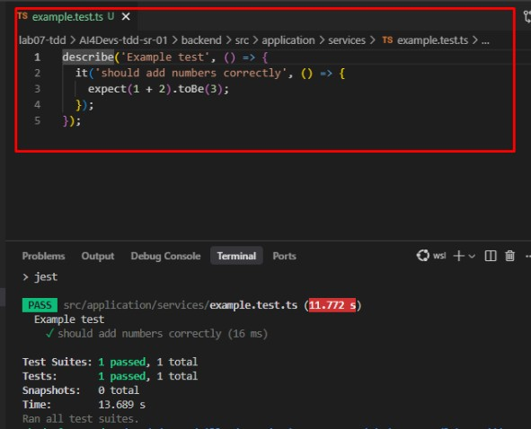
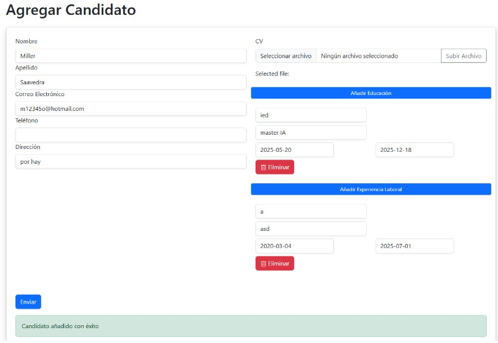
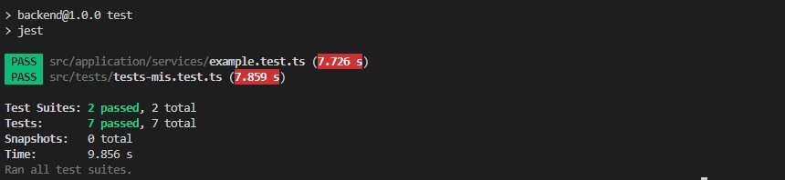

**antes de empezar puse a funcionar la solución para entender como funciona e interactuar con ella**

Nota:
(yo no me dedico a desarrollar aplicaciones mi experiencia es: la ciencia de datos/ arquitectura de datos/ ingenieria de datos/ ml - etc etc.)

por lo cual me di a la tarea de investigar sobre el ejercicio y obviamente me apoye en la IA para configurar todo lo que necesitaba
en mi en entorno local asi pues mi paso a paso fué:

## Ejercicio 1 alistar ambiente de pruebas:

1. Instalar Node.js y npm
2. Instalar Jest y dependencias para TypeScript
3. Inicializar la configuración de Jest para TypeScript
4. Crear un archivo de prueba de ejemplo: src/application/services/example.test.ts

Verificar que los tests pasen correctamente.

## Ejercicio 2 subir el back y el front:

1. Instalar dependencias del frontend, el backend ya lo tenia funcionando por el ejercicio anterior
2. Ejecuta la migración de Prisma
    * Prisma se creó y aplicó la migración llamada initial-schema.
    * La base de datos ya tiene las tablas necesarias.
    * Prisma Client se generó correctamente en ./backend/node_modules/@prisma/client.

obviamente tuve varios errores, pero a la larga logre hechar a funcionar la solución, esto porque yo necesitaba 
entender su funcionamiento para poder redctar el prompt de las pruebas, el resultado fué:

## Ejercicio 3 construir el prompt de pruebas del laboratorio propuesto:
(ahora si!! ya se a que se refiere el laboratio y que es lo que me piden hacer, de este modo puedo guiar a la IA para lograr mi obejtivo!.)

Rol:
Eres un experto en testing de JavaScript.

Objetivo:
Crear una suite de tests unitarios en Jest para la funcionalidad de inserción de candidatos en la base de datos. Utiliza buenas prácticas de testing y cubre todos los casos límite relevantes.

*   Usa el contexto del proyecto para identificar los tests más importantes.
*   Existen dos familias principales de tests:
1.  Recepción de datos del formulario (validación y procesamiento de la entrada).
2.  Guardado en la base de datos (persistencia y manejo de errores).
*   Se requieren tests que cubran ambos procesos, con al menos un test para cada uno.

Antes de continuar al desarrollo de las pruebas, dame un roadmap claro y especifico para cumplir con el objetivo y sus detalles, no hagas nada hasta que te confirme que estoy de acuerdo con el plan.

## resultado despues de refinar entre la IA y miller:

Roadmap para la suite de tests unitarios en Jest
1. Análisis del flujo de inserción de candidatos
- Identificar los módulos/funciones responsables de recibir y validar los datos del formulario.
- Identificar los módulos/funciones responsables de guardar los datos en la base de datos.
2. Diseño de casos de prueba para la recepción de datos
- Test de recepción de datos válidos.
- Test de recepción de datos incompletos o inválidos (campos obligatorios vacíos, formatos incorrectos, etc.).
- Test de manejo de datos límite (strings muy largos, caracteres especiales, etc.).
3. Diseño de casos de prueba para el guardado en base de datos
- Test de guardado exitoso de un candidato válido.
- Test de manejo de errores al guardar (por ejemplo, duplicados, errores de conexión, etc.).
- Test de persistencia de todos los campos relevantes (educación, experiencia, CV, etc.).
4. Implementación de los tests en Jest
- Crear archivos de test en la ubicación adecuada del backend.
- Usar mocks/stubs para aislar la lógica de validación y persistencia según corresponda.
5. Ejecución y verificación de los tests
- Ejecutar la suite de tests y asegurar que cubren los casos definidos.
- Ajustar o agregar tests según los resultados y la cobertura.

estoy de acuerdo, las pruebas deben quedar en el archivo lab07-tdd\AI4Devs-tdd-sr-01\backend\src\tests\tests-mis.test.ts porfavor diferenciarlas en el mismo orden que me las diste y con los comentarios para poderlas identificar.

## Ejercicio 4 ejecutar las pruebas:

Nota: en el primer intento tuve un problema con la ejecución pero lo solucione así:

1. Ignorar la carpeta dist/ en Jest
Editar archivo jest.config.js (en la raíz del backend) y agregar o modificar la opción testPathIgnorePatterns para que ignore la carpeta dist/:

2. Elimina los archivos de test de la carpeta dist/
Puedes limpiar la carpeta dist/ para evitar confusiones:

Resumen:
Jest solo debe ejecutar los tests en src/, no en dist/.
El error no afecta la validez de los tests en src/, que sí están pasando correctamente.

npm test

